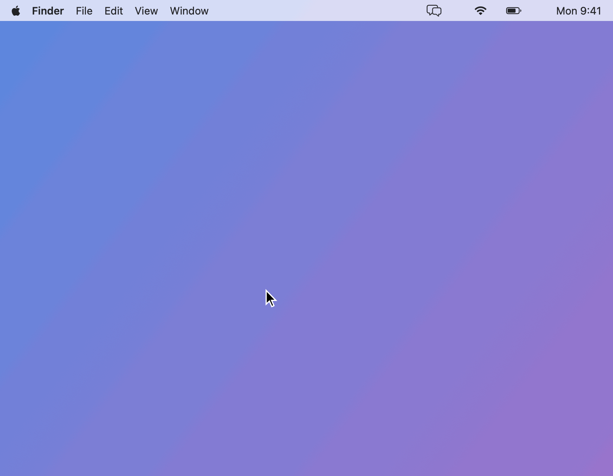
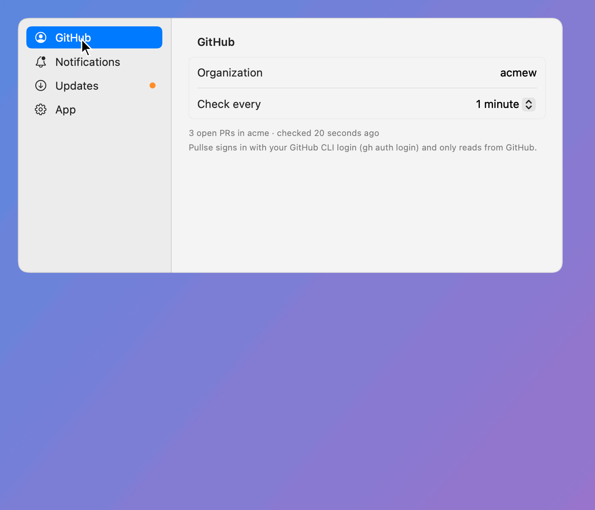
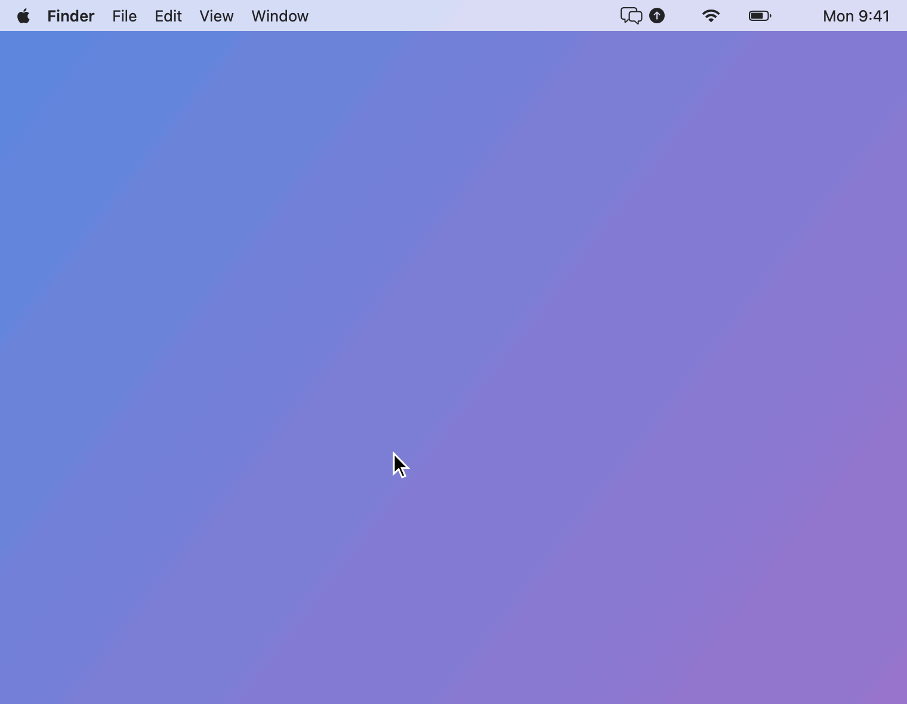

# Pullse

[](../../actions/workflows/release.yml)
[](../../releases/latest)
[](LICENSE)

A macOS menu bar app that sends a native notification when something happens on your
GitHub pull requests in an organization you choose:

- **comments** on your PRs, both conversation comments and inline review comments
- **reviews** on your PRs: approved, changes requested, or a review with a summary
- **CI results** on your PRs: failures only (default), or passes and cancellations too
- **@mentions** of you in other people's PRs

You can turn each of these on or off, and bots (github-actions, Terraform plan bots,
dependabot, …) are muted by default. Clicking a notification opens the comment, review or
check. The menu bar icon shows an unread count, and its popover lists recent activity
grouped by PR. Right-click the icon for About (the GitHub repository), Settings and Quit.

## See it in action

**Something happens on your PR.** A review or a failed CI run shows up as a native
notification, the menu bar count goes up, and the menu lists it with an unread dot,
grouped by pull request. Clicking a notification or a row opens it on GitHub.

<p align="center">
  
</p>

**Choose what you hear about.** Settings has a tab per area: the organization and how
often to check, which events notify and which to filter out, updates, and startup.

<p align="center">
  
</p>

**Updates install themselves.** When a new release is out, the icon gets an arrow and the
menu offers it. Install downloads it, checks it, swaps it in and relaunches, and a
notification confirms the new version. Turn on automatic installs to skip the click.

<p align="center">
  
</p>

## Requirements

- macOS 14+
- The [GitHub CLI](https://cli.github.com/), logged in (`gh auth login`). The app uses
  your `gh` token and has no credentials of its own.
- To build from source: a Swift 6 toolchain (Xcode, or just the Command Line Tools,
  `xcode-select --install`).

## Download

**[⬇ Download the latest release](../../releases/latest)** · [All releases](../../releases) ·
[Changelog](CHANGELOG.md)

Each release is built by GitHub Actions from `main` and carries two files:

| File | What it is |
| --- | --- |
| `Pullse-<version>.zip` | the app, ad-hoc signed |
| `Pullse-<version>.zip.sha256` | its SHA-256, which the in-app updater checks before installing |

The release notes are that version's section of [CHANGELOG.md](CHANGELOG.md). A new
release is published automatically whenever changes with changelog notes land on `main`
(see [Versions and releases](#versions-and-releases)). If the repository is private, you
need read access to it both to download and for the app's update checks, which use your
`gh` login.

To install:

1. Unzip it and move `Pullse.app` to `~/Applications` (or `/Applications`) in Finder.
2. Open it. Releases are ad-hoc signed rather than notarized, so the first time macOS
   says it can't check the app. Go to System Settings → Privacy & Security, click
   **Open Anyway** next to the message about Pullse, and confirm.

If you open it straight from Downloads, or it was moved some other way than with Finder,
macOS runs it from a temporary read-only copy where it can't update itself. Pullse
notices and offers to **Move to Applications**: it copies itself there, clears the
download flag and restarts. The same button shows in the update banner and in Settings →
Updates until it has moved.

That approval is needed only once. Updates Pullse installs itself are downloaded by the
app, not by a browser, so they don't prompt again.

Every CI run also keeps a build of that commit as a downloadable artifact for 14 days
(the run's Summary page → Artifacts).

## Updates

Pullse checks the repository's releases on launch and every hour. When a newer one
exists, the menu bar icon gets an arrow and the menu shows **Pullse x.y.z is available**,
with *What's new* and *Install*. The same buttons appear on the Updates tab in Settings, so
after *Check now* you can install from there. Install downloads the release, checks it against its
published SHA-256, checks that it is Pullse at the expected version with an intact
signature, swaps it in and relaunches. After the relaunch a notification confirms the
new version.

Turn on **Install updates automatically** in Settings to have that happen without asking.
An automatic install waits while the menu or Settings is open, so Pullse never restarts
under you. To skip the "updated" notification too, turn off **Notify me after Pullse
updates**. Updates install in place only when Pullse lives in `/Applications` or `~/Applications`.
Anywhere else, Install opens the release page instead. Prereleases are skipped unless
**Include prereleases** is on.

A build knows where to look because `scripts/build-app.sh` stamps it with the GitHub
repository it was built from (from CI, or the `origin` remote). A build without one has
update checks turned off.

## Build and run

```sh
make install   # build, copy to ~/Applications, launch
make run       # build and launch from ./build without installing
make check     # one live fetch: print what the last 24h would have notified about
make test      # unit tests
make demo      # re-render the animated GIFs in docs/demo from the same sample data
make dist      # build, then zip it as build/Pullse-<version>.zip with a .sha256
make stats     # download counts per release, and the repo's traffic (read-only)
```

The first time it launches, macOS asks to allow notifications. If you miss that prompt,
turn notifications on in System Settings → Notifications → Pullse. Then open Settings…
from the menu (or right-click the menu bar icon), enter the GitHub organization to watch
on the GitHub tab, and turn on "Launch at login" on the App tab if you want it. Pullse does nothing until an organization is set.

## Settings

The Settings window has a tab for each area, listed down the left side:

| Tab | What's on it |
| --- | --- |
| **GitHub** | the organization to watch, how often to check, and the result of the last check |
| **Notifications** | which events notify, the CI results mode, filters (bots, muted repositories), and a test notification. A warning appears here when macOS isn't showing Pullse's notifications |
| **Updates** | the running version, Check now, and the automatic update toggles |
| **App** | Launch at login, and where the settings file lives |

A dot on a tab means it needs a look: notifications are off, or an update is waiting.

The Settings tour in [See it in action](#see-it-in-action) shows each tab.

Everything specific to you lives in `~/.config/pullse/settings.json`, outside this
repository. The app creates the file with defaults on first launch. The Settings window
edits it, and changes made by hand are picked up on the next check.

```json
{
  "org": "your-org",
  "pollSeconds": 60,
  "notifyComments": true,
  "notifyReviews": true,
  "notifyCI": true,
  "notifyMentions": true,
  "ciResults": "failuresOnly",
  "includeBots": false,
  "mutedRepos": ["sandbox", "your-org/legacy-app"],
  "checkForUpdates": true,
  "autoUpdate": false,
  "includePrereleases": false,
  "notifyAfterUpdate": true,
  "bundleIdentifier": "com.yourname.pullse"
}
```

Every key is optional. `ciResults` is `failuresOnly` or `all`. `mutedRepos` takes a bare
repo name or `owner/name`. If the file stops parsing, Pullse keeps its last good
settings, shows the error in the menu, and doesn't write to the file until it is fixed.

`bundleIdentifier` is only read by `scripts/build-app.sh`: macOS remembers notification
permission and login items per bundle id, so pick one and keep it. A `BUNDLE_ID`
environment variable overrides it; with neither, builds use `com.example.pullse`. Set
`PULLSE_SETTINGS` to use a different settings file.

## How it decides what's new

Every poll (default: every minute) makes one GraphQL request for your open PRs in the org,
plus a second one for recent PRs that mention you. It fetches their comments, reviews,
review threads and the head commit's checks. An item gets a notification only when:

1. it hasn't been seen before, **and**
2. it happened after the previous poll (with 5 minutes of slack for search-index lag).

Rule 2 is why a first launch, a PR that just showed up in the search, or turning an event
type back on never floods you with old history. After the Mac has been asleep you get what
happened while it slept, and more than 5 events at once are combined into one summary
notification.

Other rules:

- Your own comments never notify.
- A "comment" review with no summary is only a container for inline comments. Those
  comments are reported one by one, so the review itself isn't.
- All the CI checks that finish on one PR in one poll become a single notification
  ("CI failed: lint, test +3"). A re-run that fails again notifies again.

Pullse only reads from GitHub: its GraphQL requests are queries, never mutations, and a
test enforces that. State (seen ids and recent history) is kept in
`~/Library/Application Support/Pullse/state.json`. Delete it to start over.

## Versions and releases

The version lives in `VERSION` (SemVer), and `CHANGELOG.md` records every change under
`## [Unreleased]` until it ships. The build number is CI's run number, or the commit count
for local builds.

Changes reach `main` only through pull requests: `main` is protected by a ruleset that
requires a PR with a passing `build` check and one approval from a maintainer, and blocks
direct and force pushes. Releases are automatic. Every merge to `main` runs
`.github/workflows/release.yml`, which tests and builds the app, and releases it if there
are notes under `[Unreleased]`. The
notes decide the version (`scripts/next-version.sh`):

| Under `[Unreleased]` | Bump | Example |
| --- | --- | --- |
| nothing | no release; the build is kept as an artifact | |
| only `### Fixed` / `### Security` | patch | 0.3.1 → 0.3.2 |
| `### Added` / `Changed` / `Deprecated` / `Removed` | minor | 0.3.1 → 0.4.0 |
| `### Breaking` | major (minor while below 1.0) | 1.4.2 → 2.0.0 |

The workflow moves the notes into a dated `[x.y.z]` section, writes `VERSION`, and pushes a
"Release x.y.z" commit and a `vx.y.z` tag back to `main`. That push is the one exception to
the pull request rule: it uses a deploy key kept in the `release` environment, which only
`main` can use. It then publishes a GitHub release with the zip, its checksum, and those
notes. Update your branch from `main` after a release, because the release commit sits on
top of the merge. If two merges land close together, the later run releases both.

To pick a version yourself, such as 1.0.0 or a prerelease like `1.1.0-beta.1`, run the
workflow by hand: Actions → Release → Run workflow, with the version filled in. Prereleases
are marked as such on GitHub.

### Download counts

`make stats` (`scripts/stats.sh`) reads GitHub's download counters for every release. Only
the in-app updater fetches a release's `.sha256`, so its count is the number of in-app
updates, and what the `.zip` has on top of that is manual downloads. It also shows the
repository's views and clones over the last 14 days (that part needs push access).
Installs themselves aren't counted: Pullse sends nothing anywhere.

### CI

`.github/workflows/ci.yml` tests and builds every pull request on a macOS runner, and
uploads the zipped app as an artifact. A newer push to the PR cancels a run still in
progress.

Set the bundle id once as a repository variable (Settings → Secrets and variables →
Actions → Variables → `BUNDLE_ID`) so CI and release builds use it. Keep it the same as
your local `bundleIdentifier`. macOS remembers notification permission per bundle id, and
the updater refuses a download whose bundle id differs from the running app's. Without the
variable, builds use the placeholder `com.example.pullse`.

## Layout

```
Sources/PullseCore/   GitHub client, GraphQL queries, models, EventDetector (pure, tested)
Sources/Pullse/       SwiftUI menu bar app, notifications, settings
Tests/PullseTests/    detector, decoding, settings and update tests
Support/Info.plist    bundle metadata (LSUIElement: no Dock icon; version stamped at build)
LICENSE, NOTICE       Apache 2.0 license and copyright notice
scripts/              build-app.sh, package.sh, release.sh, next-version.sh, changelog-section.sh, test.sh
.github/workflows/    ci.yml (pull requests), release.yml (merges to main)
```

Views use `State(initialValue:)` instead of `@State`. In the macOS 27 SDK, `@State` is a
macro, and its compiler plugin ships only with Xcode, so `@State` would break builds that
use just the Command Line Tools.

## License

Pullse is licensed under the [Apache License, Version 2.0](LICENSE). Copyright 2026
Pullse contributors; see [NOTICE](NOTICE).
